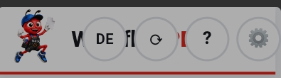
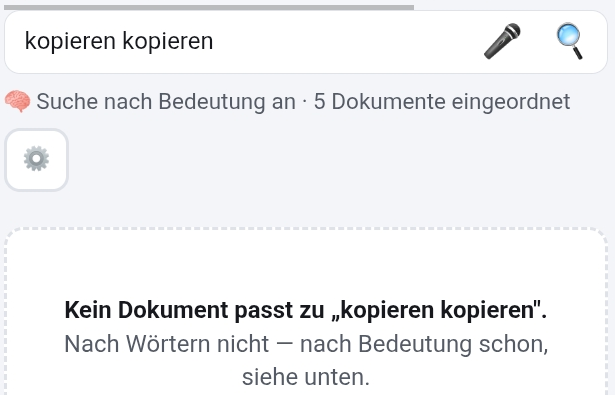

# To-Do · Workflow-Repos

**Angelegt 2026-09-27 auf Klaus' Wort.** Jedes Mal, wenn Klaus „To-Do für
Workflow" sagt, kommt der Punkt hierher — wörtlich, mit Datum. Abgearbeitet
wird die Liste später in einem Plan bzw. über den Brief für die nächste
Sitzung, nicht nebenbei.

## Wofür die Liste gilt

| Repo | Was |
|---|---|
| **Workflow-PDF** | die PWA „Workfloh PDF" — Quelle der geteilten `assets/` |
| **Mein-WorkFloh** | trägt `assets/wfpdf/` (byte-1:1 aus Workflow-PDF) + `werkzeug.js` |
| **Tomys-Hub** (`workfloh/`) | dasselbe, parallel zu Mein-WorkFloh |

Die Liste steht **nur hier**, nicht dreimal. Betrifft ein Punkt eine geteilte
Datei, wird er hier behoben und dann in die WorkFlohs kopiert.

## So wird eingetragen

- Eine Zeile je Punkt: `- [ ] YYYY-MM-DD · <Repo> · <was Klaus gesagt hat>`
- Klaus' Wortlaut bleibt stehen; eine Einordnung (Ursache, Datei) kommt erst
  beim Abarbeiten dazu, als eingerückte Zeile darunter.
- Erledigt → `- [x]`, mit PR-Nummer. Nicht löschen.
- Unklar, welches Repo → `alle` eintragen und beim Abarbeiten klären.

## Offen

- [ ] 2026-09-27 · Workflow-PDF (in den WorkFlohs mitprüfen) · **Schieberegler bei den Ordner-Knöpfen kaum greifbar.**
  Klaus: „Wenn die App auf kleinen Handys ist oder schmal gezogen wird und die Ordner über den Rand
  ragen, entsteht ein Schieberegler. Also bei den Ordner-Buttons. Der Schieberegler ist aber ganz
  schlecht anzufassen. Das heißt, es müsste da ein Griff sein oder ein kleines Viereck, wo man
  erkennt: ah, das ist ein Schieberegler, mit dem kann man es hin und her schieben."
- [ ] 2026-09-27 · Workflow-PDF (in den WorkFlohs mitprüfen) · **Pfeil nach oben neben dem Markieren-Punkt.**
  Klaus: „In einer schmalen Handyansicht scrolle ich nach unten und die Dokumente scrollen der Reihe
  nach nach unten. Es sollte neben dem Markierenpunkt noch ein Pfeil nach oben sein. Also rechts oben
  ist ein Punkt, wo ich den markieren kann. Und der Pfeil nach oben sollte komplett einmal bis nach
  oben scrollen. Sonst muss ich die ganzen Dokumente wieder nach oben scrollen, um an die
  Bedienelemente heranzukommen."
- [ ] 2026-09-27 · Workflow-PDF · **Kopfleisten-Knöpfe überlagern den Schriftzug.**
  Klaus: „Die Button oben in Workflow PDF, Deutsch, also DE, Aktualisieren, Fragezeichen und
  Zahnrädchen werden bei einer schmalen Handyansicht zu groß und gehen auf Workflow PDF Schrifttext,
  überlagern ihn."
  Beleg (Klaus' Bildschirmfoto 2026-09-27, schmales App-Fenster in DeX, nur die Kopfleiste ausgeschnitten):
  vom Schriftzug sind nur „W" und „fl" zu sehen, der Rest liegt unter DE · ⟳ · ? · ⚙️.
  
- [ ] 2026-09-27 · Workflow-PDF · **Nach Erstellungsdatum suchen und sortieren.**
  Klaus: „Die Sortieren- oder Zuletzt-geändert- oder Suchen-Funktion sollte noch eine Datumsfunktion
  beinhalten. Das heißt, wenn ich ein Dokument nach Datum suche — nach Datum nicht sortieren, sondern
  nach Datum suchen. Das heißt nur das Dokument, nicht der Inhalt. Wann wurde das Datum erstellt?
  Oder eben nicht Name, zuletzt geändert, Dateigröße, Seitenzahl, sondern Erstellungsdatum."
  (Also zwei Wünsche: Suche nach dem Erstellungsdatum des DOKUMENTS, nicht nach Daten im Inhalt —
  und „Erstellungsdatum" als weitere Sortierung neben Name · Zuletzt geändert · Dateigröße · Seitenzahl.)
- [ ] 2026-09-27 · Workflow-PDF + beide WorkFlohs (`sprechen.js` ist byte-1:1 geteilt) · **Spracheingabe schreibt Wörter doppelt.**
  Klaus: „Bei der Mikrofoneingabe über Sprache spreche ich nur ein Wort und er macht immer zwei Worte.
  Also gleich am Anfang. Ich habe nur einmal ‚kopieren' gesagt, er macht es zweimal rein. Das ist bei
  allen Sachen so gewesen bis jetzt. Manchmal sogar dreimal."
  Beleg (Klaus' Bildschirmfoto 2026-09-27, nur Suchfeld ausgeschnitten): im Feld steht
  „kopieren kopieren", die Suche meldet „Kein Dokument passt zu ‚kopieren kopieren'".
  
- [ ] 2026-09-27 · Workflow-PDF + beide WorkFlohs (`sprechen.js` geteilt) · **Sprach-Laufbalken: zu spät, falscher Ort, kein Stopp.**
  Klaus: „Der Anzeigenbalken für die Sprache taucht zu spät auf. Und er sollte in dem Feld sein, wo
  der Text dann hineinkommt. Genauso wie hier in Claude. Und ein Stoppen-Button sollte sein. Und statt
  ein Suche ein Pfeil. Ne, Suche ist okay."
  (Also: Balken sofort beim Drücken · IM Eingabefeld statt darunter, wie in der Claude-App · eigener
  Stopp-Knopf · die Lupe zum Suchen bleibt, kein Pfeil.)

## Erledigt

_(noch leer)_
