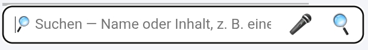
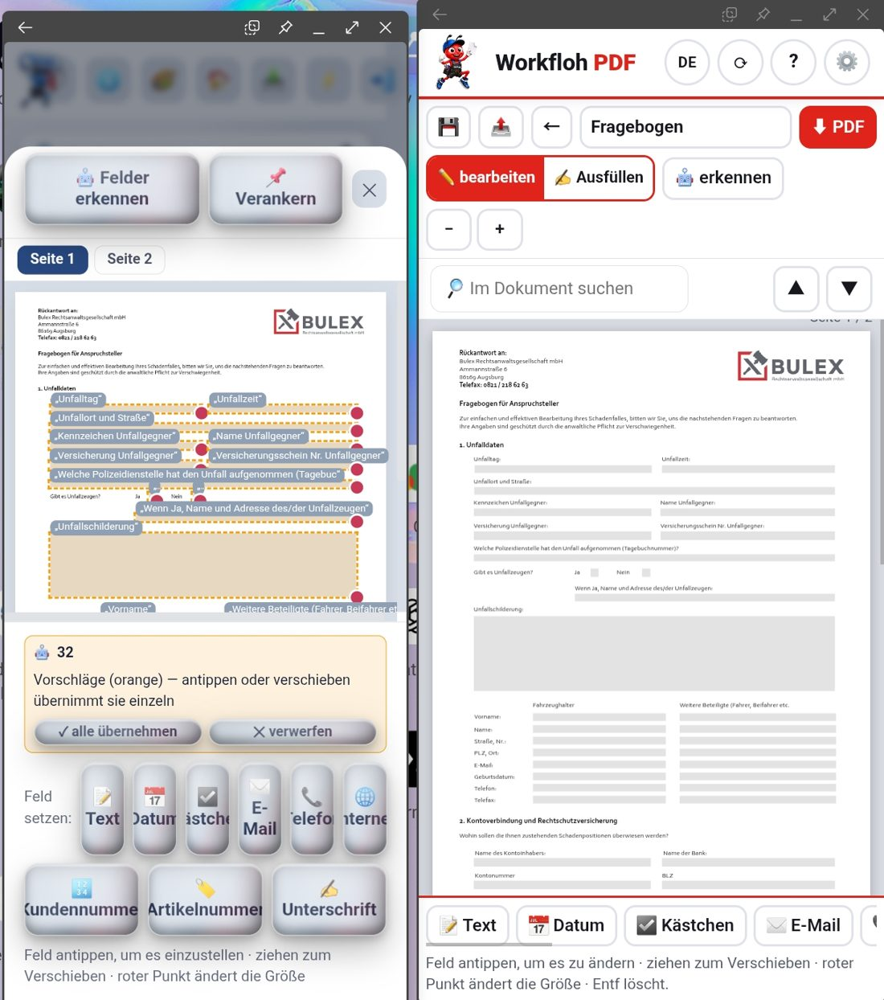
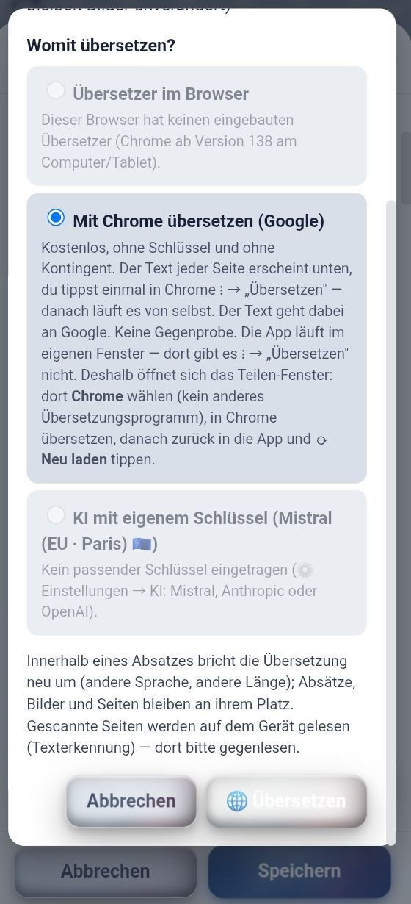

# To-Do · Workflow-Repos

**Angelegt 2026-09-27 auf Klaus' Wort.** Jedes Mal, wenn Klaus „To-Do für
Workflow" sagt, kommt der Punkt hierher — wörtlich, mit Datum. Abgearbeitet
wird die Liste später in einem Plan bzw. über den Brief für die nächste
Sitzung, nicht nebenbei.

## Wofür die Liste gilt

| Repo | Was |
|---|---|
| **Workflow-PDF** | die PWA „Workfloh PDF" — Quelle der geteilten `assets/` |
| **Mein-WorkFloh** | trägt `assets/wfpdf/` (byte-1:1 aus Workflow-PDF) + `werkzeug.js` |
| **Tomys-Hub** (`workfloh/`) | dasselbe, parallel zu Mein-WorkFloh |

Die Liste steht **nur hier**, nicht dreimal. Betrifft ein Punkt eine geteilte
Datei, wird er hier behoben und dann in die WorkFlohs kopiert.

## So wird eingetragen

- Eine Zeile je Punkt: `- [ ] YYYY-MM-DD · <Repo> · <was Klaus gesagt hat>`
- Klaus' Wortlaut bleibt stehen; eine Einordnung (Ursache, Datei) kommt erst
  beim Abarbeiten dazu, als eingerückte Zeile darunter.
- Erledigt → `- [x]`, mit PR-Nummer. Nicht löschen.
- Unklar, welches Repo → `alle` eintragen und beim Abarbeiten klären.

## Offen

- [ ] 2026-09-27 · Workflow-PDF (in den WorkFlohs mitprüfen) · **Schieberegler bei den Ordner-Knöpfen kaum greifbar.**
  Klaus: „Wenn die App auf kleinen Handys ist oder schmal gezogen wird und die Ordner über den Rand
  ragen, entsteht ein Schieberegler. Also bei den Ordner-Buttons. Der Schieberegler ist aber ganz
  schlecht anzufassen. Das heißt, es müsste da ein Griff sein oder ein kleines Viereck, wo man
  erkennt: ah, das ist ein Schieberegler, mit dem kann man es hin und her schieben."
- [ ] 2026-09-27 · Workflow-PDF (in den WorkFlohs mitprüfen) · **Pfeil nach oben neben dem Markieren-Punkt.**
  Klaus: „In einer schmalen Handyansicht scrolle ich nach unten und die Dokumente scrollen der Reihe
  nach nach unten. Es sollte neben dem Markierenpunkt noch ein Pfeil nach oben sein. Also rechts oben
  ist ein Punkt, wo ich den markieren kann. Und der Pfeil nach oben sollte komplett einmal bis nach
  oben scrollen. Sonst muss ich die ganzen Dokumente wieder nach oben scrollen, um an die
  Bedienelemente heranzukommen."
- [ ] 2026-09-27 · Workflow-PDF · **Kopfleisten-Knöpfe überlagern den Schriftzug.**
  Klaus: „Die Button oben in Workflow PDF, Deutsch, also DE, Aktualisieren, Fragezeichen und
  Zahnrädchen werden bei einer schmalen Handyansicht zu groß und gehen auf Workflow PDF Schrifttext,
  überlagern ihn."
  Beleg (Klaus' Bildschirmfoto 2026-09-27, schmales App-Fenster in DeX, nur die Kopfleiste ausgeschnitten):
  vom Schriftzug sind nur „W" und „fl" zu sehen, der Rest liegt unter DE · ⟳ · ? · ⚙️.
  
- [ ] 2026-09-27 · Workflow-PDF · **Nach Erstellungsdatum suchen und sortieren.**
  Klaus: „Die Sortieren- oder Zuletzt-geändert- oder Suchen-Funktion sollte noch eine Datumsfunktion
  beinhalten. Das heißt, wenn ich ein Dokument nach Datum suche — nach Datum nicht sortieren, sondern
  nach Datum suchen. Das heißt nur das Dokument, nicht der Inhalt. Wann wurde das Datum erstellt?
  Oder eben nicht Name, zuletzt geändert, Dateigröße, Seitenzahl, sondern Erstellungsdatum."
  (Also zwei Wünsche: Suche nach dem Erstellungsdatum des DOKUMENTS, nicht nach Daten im Inhalt —
  und „Erstellungsdatum" als weitere Sortierung neben Name · Zuletzt geändert · Dateigröße · Seitenzahl.)
- [ ] 2026-09-27 · Workflow-PDF + beide WorkFlohs (`sprechen.js` ist byte-1:1 geteilt) · **Spracheingabe schreibt Wörter doppelt.**
  Klaus: „Bei der Mikrofoneingabe über Sprache spreche ich nur ein Wort und er macht immer zwei Worte.
  Also gleich am Anfang. Ich habe nur einmal ‚kopieren' gesagt, er macht es zweimal rein. Das ist bei
  allen Sachen so gewesen bis jetzt. Manchmal sogar dreimal."
  Beleg (Klaus' Bildschirmfoto 2026-09-27, nur Suchfeld ausgeschnitten): im Feld steht
  „kopieren kopieren", die Suche meldet „Kein Dokument passt zu ‚kopieren kopieren'".
  
- [ ] 2026-09-27 · Workflow-PDF + beide WorkFlohs (`sprechen.js` geteilt) · **Sprach-Laufbalken: zu spät, falscher Ort, kein Stopp.**
  Klaus: „Der Anzeigenbalken für die Sprache taucht zu spät auf. Und er sollte in dem Feld sein, wo
  der Text dann hineinkommt. Genauso wie hier in Claude. Und ein Stoppen-Button sollte sein. Und statt
  ein Suche ein Pfeil. Ne, Suche ist okay."
  (Also: Balken sofort beim Drücken · IM Eingabefeld statt darunter, wie in der Claude-App · eigener
  Stopp-Knopf · die Lupe zum Suchen bleibt, kein Pfeil.)
- [ ] 2026-09-27 · Workflow-PDF · **Zwei Lupen im leeren Suchfeld.**
  Klaus: „Eine Doppelung im Suchfeld, wenn kein Text drin steht. Und zwar zweimal die Lupe. Die erste
  Lupe muss nicht sein. Oder du machst anstatt der zweiten Lupe rechts des großen Buttons einen Pfeil.
  So wie hier auch."
  (Zwei Wege, Klaus lässt die Wahl: die Lupe links im Platzhalter weglassen — ODER den Such-Knopf
  rechts zum Pfeil machen, wie der Senden-Pfeil in der Claude-App. Hängt mit Punkt 6 zusammen: dort
  hieß es „Suche ist okay"; beim Abarbeiten beide zusammen entscheiden.)
  Beleg (Klaus' Bildschirmfoto 2026-09-27, nur Suchfeld): links 🔎 im Platzhalter, rechts 🎤 und noch einmal 🔎.
  

## Offen · Tomys WorkFloh (`Tomys-Hub/workfloh/`)

**Angelegt 2026-09-27 auf Klaus' Wort:** „Ich sage dir der Reihe nach, was zu machen ist an
Tommys Hub Workflow." Eigener Abschnitt, damit Tomys Punkte beim Abarbeiten nicht zwischen den
geteilten untergehen — die Liste bleibt trotzdem **eine** Datei. Betrifft ein Punkt eine geteilte
Datei (`assets/wfpdf/…`, `werkzeug.js`), wird er beim Abarbeiten auch in Mein-WorkFloh geprüft.

- [ ] 2026-09-27 · Tomys WorkFloh, danach Mein-WorkFloh · **„PDF bearbeiten" wie in Workflow PDF aufbauen, eigene Knöpfe behalten.**
  Klaus: „Mache bitte Tommys Workflow PDF bearbeiten in der Ansicht … genauso wie Workflow PDF.
  Aufbau, Button, Anordnung, Funktionen sind gleich. Die gleichen Zuordnungskategorien unten. Nur
  die Farbe und das UI und die Art, wie es aufgebaut ist, also die Button, wie sie aufgebaut sind,
  die Farbe und die Art, wie sie wackeln und was sie alles können, das soll gleich bleiben in
  Tommys Workflow. Der Rest soll in der Art, wie es angerichtet ist, gleich sein von Workflow PDF.
  Und das ziehst du dann bitte auch bei meinem Workflow nach. Das soll genauso aufgebaut sein. Nur
  die eigenen Buttonform und Button von meinem Workflow sollen bleiben."
  (Also: **von Workflow PDF übernehmen** — Aufbau und Anordnung des Bearbeiten-Fensters: Kopfzeile
  mit Speichern · Teilen · Zurück · Name · PDF, die Umschalter bearbeiten/Ausfüllen/erkennen,
  − / +, „Im Dokument suchen" mit ▲▼, die Seite groß darunter, die Feldarten-Leiste unten mit
  denselben Kategorien und dem Hinweis. **Bleibt WorkFloh-eigen** — Knopfform, Farbe, das Wackeln
  und was die Knöpfe können. Erst Tomys WorkFloh, dann Mein-WorkFloh gleich nachziehen.)
  Beleg (Klaus' Bildschirmfoto 2026-09-27, zwei App-Fenster ausgeschnitten): links Tomys WorkFloh
  „Felder erkennen / Verankern", Seite 1 · 2, Vorschläge-Kasten, Feld setzen mit Glas-Knöpfen —
  rechts Workflow PDF im Modus „bearbeiten".
  
- [ ] 2026-09-27 · alle drei (Workflow PDF zuerst als Vorlage, dann Tomys WorkFloh und Mein-WorkFloh) · **Sichtbarer Schieberegler unter der Feldarten-Leiste.**
  Klaus: „In allen drei Workflows machst du unten genau in derselben Ansicht, wo Texte, Datum,
  Kästchen, E-Mail und so eingestellt werden können, noch einen Schieberegler. Und zwar so, dass man
  ihn anfassen kann mit einem Viereck oder wie auch immer, sodass man sieht, dass da ein
  Schieberegler ist. Bei kleineren Handys ist sonst nicht zu erkennen, dass da noch mehr folgt.
  Vorlagen, wie gesagt, Workflow PDF. Für beide. Für Tommy und für meinen Workflow."
  (Gemeint ist die untere Leiste im Bearbeiten-Fenster: Text · Datum · Kästchen · E-Mail · … — auf dem
  Bildschirmfoto zu Punkt 1 ist sie rechts abgeschnitten, und man sieht nicht, dass noch Knöpfe
  folgen. Derselbe Wunsch wie beim Ordner-Schieberegler weiter oben — beim Abarbeiten EINE Bauweise
  für beide Leisten nehmen.)
- [ ] 2026-09-27 · Tomys WorkFloh · **„Übersetzen"-Knopf nicht lesbar: weiße Schrift auf hellem Grund.**
  Klaus: „In Tommys Workflow ist bei PDF übersetzen oder Fragebogen jeweils PDF übersetzen, der
  Übersetzen-Button weiße Schrift auf weißem, hellem Untergrund, nicht zu lesen."
  (Der Knopf, der die Übersetzung startet, im Dialog „🌐 PDF übersetzen" — sowohl in der Akte als
  auch beim Originaldokument/Fragebogen. Beim Abarbeiten in Mein-WorkFloh mitprüfen:
  `werkzeug.js` ist in beiden WorkFlohs identisch, der Unterschied kann aber im Stil der App liegen.)
  Beleg (Klaus' Bildschirmfoto 2026-09-27, nur der Dialog ausgeschnitten): unten rechts „🌐 Übersetzen"
  in Weiß auf hellem Glas-Knopf, kaum zu erkennen.
  

- [ ] 2026-09-27 · Tomys WorkFloh + Mein-WorkFloh · **Dieselbe Maschine wie Workflow PDF: Scannen und PDF bearbeiten.**
  Klaus: „alle Funktionen … PDF bearbeiten und PDF scannen, Foto PDF scannen und PDF oder Bild aus Ordner
  einfügen … die ganze Maschinerie dahinter … soll nicht genauso aufgebaut sein, aber dieselbe Technik
  haben. Es sollen zu denselben Ergebnissen führen."
  Auftrag mit Befund (Prüfsummen) und Weg: `docs/sessions/BRIEF_workflohs-dieselbe-maschine.md`.

## Erledigt

- [x] 2026-09-27 · Workflow-PDF · **Lupe beim Zuschneiden zu groß.**
  Klaus: „Der Vergrößerungsausschnitt beim Ziehen des Punktes für die Positionierung der Polygone zum
  Zuschneiden der PDF muss kleiner sein … Auf dem kleinen Handy ist das ziemlich schwierig."
  Ursache: `.scan-bild canvas{width:100%}` schlug `.scan-lupe{width:120px}` — die Lupe war so groß wie
  das ganze Bild (gemessen 431×574). Jetzt 56–84 px, neben dem Punkt. Dabei am Handy gefunden: das Foto
  bekam nur 156 px, die oberen Ecken lagen unter der Kopfleiste — mit behoben. PR in diesem Durchgang.
